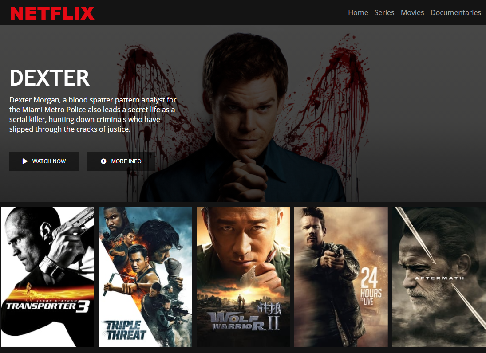

# Projeto: Recriar a interface do Netflix com HTML5, CSS3 e JavaScript.

## DESCRIÇÃO

Recrie a interface do principal site de streaming mundial utilizando tecnologias simples como HTML5, CSS3 e JavaScript. Nesse projeto você aprenderá: como estruturar um layout, técnicas de CSS3 com containers e variáveis, como posicionar os elementos com Flexbox e como utilizar plugins Jquery a favor da sua aplicação.

---

## Bootcamp HTML Web Developer - Digital Innovation One.

Aprenda a programar páginas de internet e desenvolver websites utilizando HTML, CSS e JavaScript para iniciar sua trajetória profissional em desenvolvimento web front-end.

